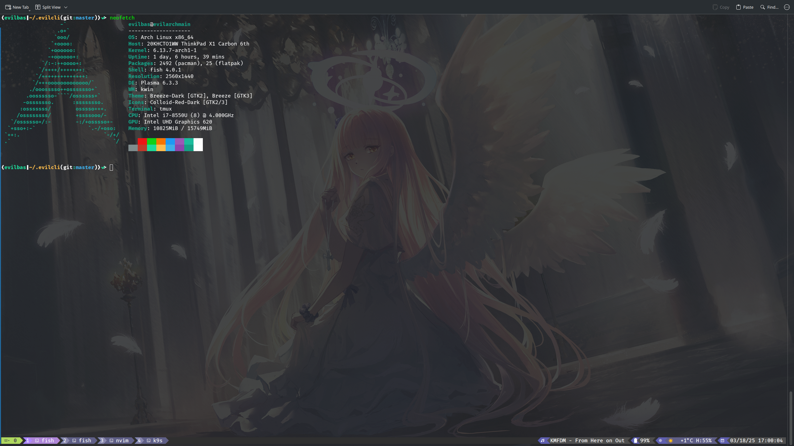
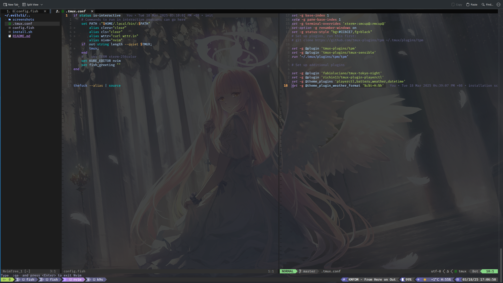

# Evilcli

## Some profile stuff for tmux + fish mostly for personal use.

### Plugins and customizations.

This is a very minimal instalation for clean look and some useful information (this is what I use, don't judge).




This includes:

1. TPM for plugin management
2. TMUX-Sensible
3. TMUX Tokyo Night (@fabioluciano)
4. TMUX Plugin Playerctl (@richin13)

### Prerequisites:

```sh
sudo pacman -S fish tmux playerctl
```

After installing tmux, prepare tmux plugin manager:

```sh
git clone https://github.com/tmux-plugins/tpm ~/.tmux/plugins/tpm
```

### Installation: 

Pull the repo somewhere (preferably some dot folder in your home directory), and run install.sh script.

```sh
git clone https://github.com/mikeyloboto/evilcli ~/.evilcli/
cd ~/.evilcli/
./install.sh
```

Make sure you have fish installed prior to running the script, as it uses fish syntax, I cannot guarantee it will work on bash/sh/zsh or others.

When making any changes to TMUX config, including after running the install script press 
```Ctrl+b -> Shift + i```
to reload config.

### Other:

For neovim config go [here](https://github.com/mikeyloboto/evilvim).
